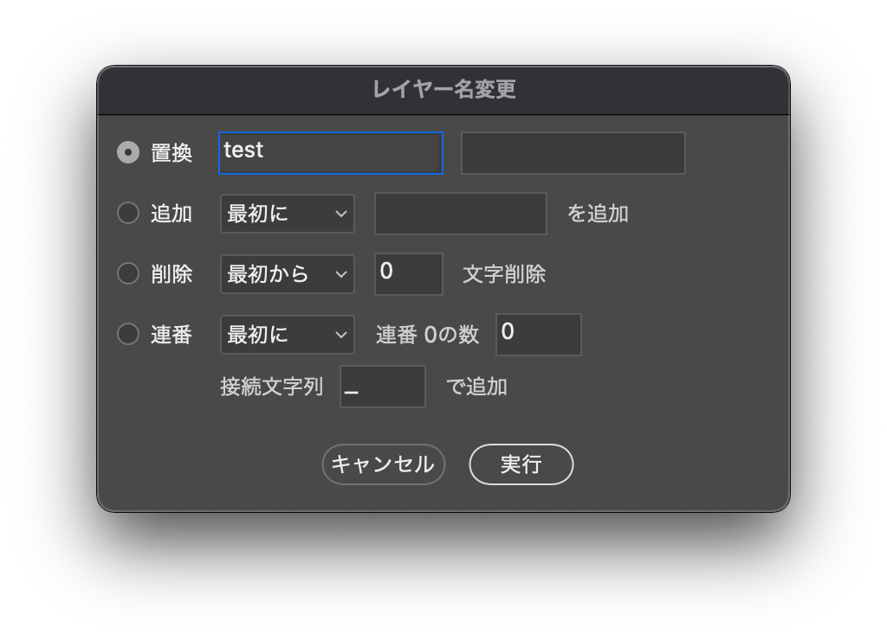

photoshop.webcreate
===================

PhotoShopでサイト作るときに便利な jsx、ショートカット、アクション

## 入っているもの
* カラーピッカー
  * colorPicker.jsx
* フォントコピー（お試し、フォント色々コピーできる？）未完成
* フォントサイズ小数点切り捨て
  * fontSizeSet.jsx
* リンクつける
  * Link.jsx
* レイヤーの名前を変更する
  * LayerName.jsx
  * LayerName2.jsx
  * LayerName_Group.jsx
  * LayerName_noCopy.jsx
* レイヤーに基づくスライス_改
  * slice_Set.jsx
  * sliceGroup_Set.jsx
  * webCreate kys.kys（一応いれてある、kamem用キーボードショートカット）
  * webCreate kys_cs5.kys（一応いれてある、kamem用キーボードショートカット CS5）
  * webCreateShortcutSet.atn（アクション、ショートカット設定済み　自分用に設定してある場合は上書きされないと思います。）

## インストール
下記フォルダに`jsx`ファイルを入れてください。

### Windows
```
C:\Program Files\Adobe\Adobe Photoshop\Presets\Scripts
```
### Mac
```
Adobe Photoshop\Presets\Scripts
```

あくまでも自分用ですので、もしも使う方がいらっしゃいましたら、自分用にショートカットなど指定してください！

## カラーピッカー
テキストとシェイプの色を同じカラーピッカーを使い変更することができます。
（CS5からしか使えない）

## フォントサイズ小数点切り捨て
テキストを自由変形などで変更した時に、文字サイズと行間が小数点になってしまう場合があります。
そのときに実行すると小数点を四捨五入してくれて、スッキリします。

### 気を付けるところ
* 同じテキスト内に異なるサイズのものが含まれている場合、一文字目のフォントサイズに合わされてしまう。
* 行間が「自動」になっていると、エラーがでてしまう。

## 「リンク」 つける、はずす（Link.jsx）
標準にもついていますが、1つしか選択されていない場合にリンクがはずれてくれないので、1つでもはずれるようにしました。

## レイヤーの名前変更 色々（LayerName.jsx）
* 複数のレイヤーの名前変更。
* 連番をつけるか聞いてくるので、「はい」を選ぶと連番をつけてくれます。
* 最後の文字を「\_」にすると聞かれずに、自動で連番をつけてくれます。（例 : test_01、test_02）
* 最初の文字を「\_」にすると、現在の名前の最後に「\_」のあとにつけた名前とともに追加してくれます。（例 : test01_hover、test02_hover）
* 最初の文字を「?」にすると、現在の名前の最初に?以降にいれた文字を追加してくれます。


## レイヤー名の置換・変更（LayerName2.jsx）
* 複数レイヤー名文字列置換を行える
* 最初と最後からの文字数指定削除が行える
* 最初と最後からの文字追加が行える
* 最初と最後に連番をつけることができる

### 上手くいかないところ
* 複数のレイヤーを同じ名前に変更した際に、最初の選択状態に戻してくれない。
* 選択したもののリンクがはずれてしまう。

## 選択しているレイヤーにはいっている「 のコピー」を消す（LayerName_noCopy.jsx）
後ろに数字がはいっていても数字ごと消してくれます。

## レイヤーに基づくスライス強化（slice_Set.jsx）
レイヤー名をスライスにつけてくれます。
### 上手くいかないところ
拡大、縮小している時に実行すると、名前がつかない。
## カスタマイズアクション
webCreateShortcutSet.atn
|  ショートカット  |  TH  |
| ---- | ---- |
|  `f1`  | 単品レイヤーの結合  |
|  `f2`  | レイヤースライス（slice_Set.jsx） |
|  `Ctrl` + `b`  |  レイヤースタイル表示  |
|  `Shift` + `Alt` + `Ctrl` + `b`  |  Shift + Alt + Ctrl + b  |
|  `Command` + `f3` |  選択しているレイヤーを一番下へ移動  |
|  `f6`  | リンク（Link.jsx） |
|  `f7`  | スマートオブジェクトの中身表示  |
|  `f8`  | スマートオブジェクトに変換 |

## カスタマイズショートカット
webCreate kys.kys

|  ショートカット  |  TH  |
| ---- | ---- |
|  `Ctrl` + `Shift` + `c`  |  レイヤー効果のコピー  |
|  `Ctrl` + `Shift` + `v`  |  レイヤー効果のペースト  |
|  `Ctrl` + `z`  |  一段階戻る  |
|  `Ctrl` + `b`  |  レイヤースタイル表示  |
|  `Shift` + `Alt` + `Ctrl` + `b`  |  Shift + Alt + Ctrl + b  |
|  `F4`  |  カラーピッカー  |
|  `Ctrl` + `r`  |  LayerName.jsx  |
|  `Ctrl` + `Shift` + `r`  |  LayerName2.jsx  |